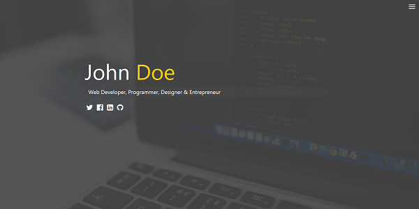

# modern-portfolio-traversyMedia
Responsivve portfolio website

This page has been based on tutorial from Traversy Media. It is a example of simple responsive page;

## Tools & Technology used

- Visual Studio Code
- HTML SASS
- CSS GRID
- FLEXBOX
- JavaScript
